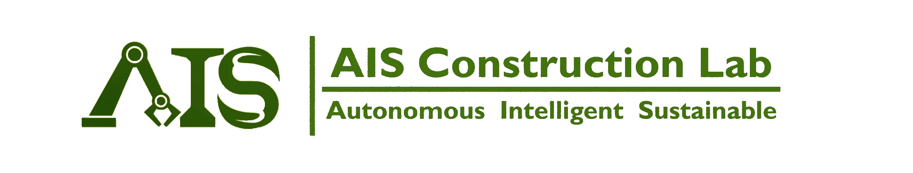
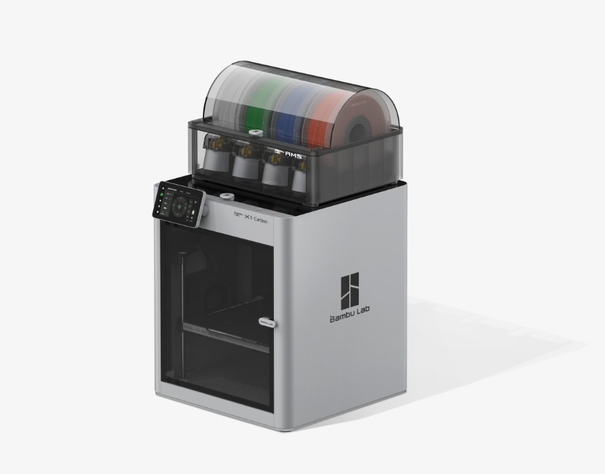
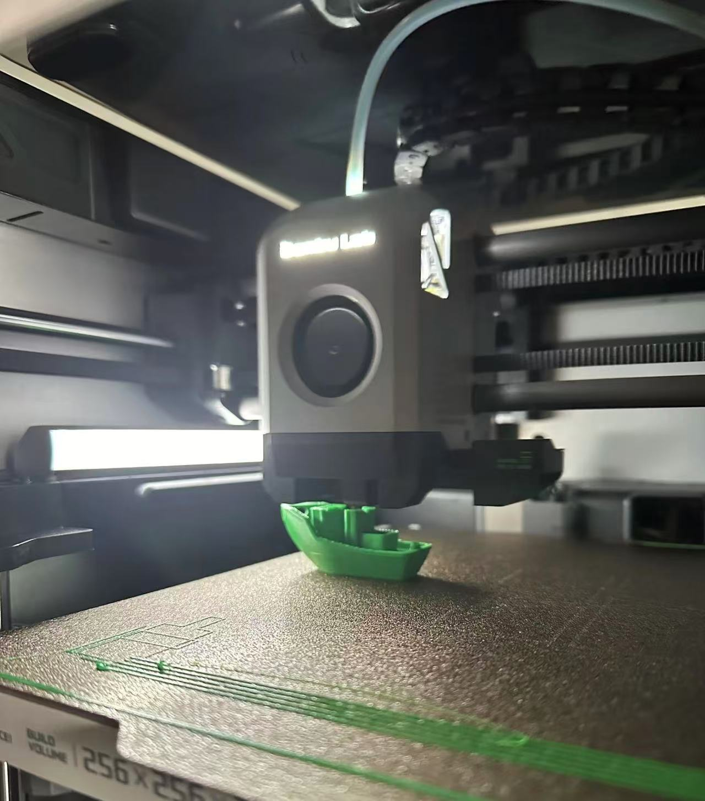
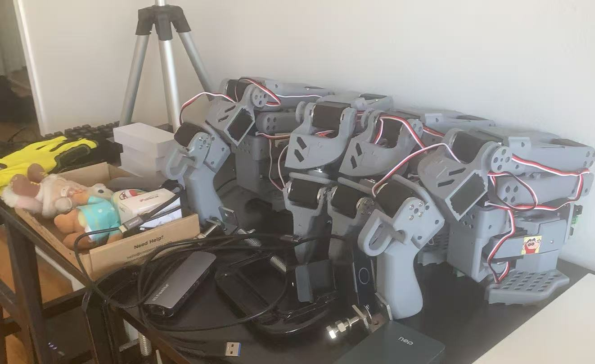
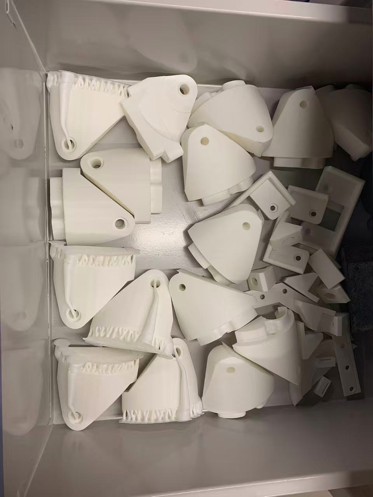

# AIS 3D-PRINTING LAB 

[🌐 Visit Our Lab Website](https://www.shao-lab.com/)

## 🏗️ System Overview

Welcome to our system documentation! This overview provides a high-level look at our features. Please note that this documentation is a work in progress and will be continuously updated with more detailed guides and instructions.

### 📑 Information Hub

**Maintenance Tracking System**

1. Real-time machine monitoring and maintenance logging
2. Comprehensive wiki for template configurations
3. Detailed documentation of customization options

### 📊 Dashboard & Reports

**Visual Analytics**

1. Interactive project timeline visualization
2. Live progress monitoring dashboard
3. Advanced template usage analytics

### 🗂️ Resource Center

**Collaboration Tools**

1. Streamlined workspace collaboration platform
2. Advanced template organization system

### 📝 Task Management

**Productivity Suite**

1. Intuitive task tracking interface
2. Comprehensive activity logging system
3. Advanced project planning toolkit

### 💾 Data Management

**Secure Infrastructure**

1. Integrated resource monitoring system

## Project Overview

This repository is a 3D printing model files backup repository for the AIS Construction Lab at McGill University, specifically designed for the lab's Bamboo X1C 3D printer. The repository contains various 3D printing model files required by the laboratory for manufacturing robotic systems, mobile platforms, and related equipment.

## Supported 3D Printers

 

*Bambu Lab X1-Carbon printer and 3D Benchy benchmark test*

- **Bambu Lab X1-Carbon** (Primary support)
  - Print Volume: 256 × 256 × 256 mm
  - Supported Materials: PLA, PETG, ABS, TPU, PA, PC, ASA
  - Layer Resolution: 0.1-0.3mm
  - Nozzle Temperature: Up to 300°C
  - Bed Temperature: Up to 100°C

*Bambu Lab X1-Carbon printing 3D Benchy benchmark test*

### Printer Specifications
- **Build Volume**: 256 × 256 × 256 mm
- **Layer Height**: 0.1-0.3mm (recommended: 0.2mm)
- **Print Speed**: Up to 500mm/s
- **Supported File Formats**: .stl, .3mf, .gcode
- **Connectivity**: WiFi, USB, SD Card

### Recommended Settings
- **Layer Height**: 0.2mm for standard prints, 0.1mm for detailed prints
- **Infill**: 20-30% for structural parts, 10-15% for decorative parts
- **Support**: Auto-generated supports for overhangs >45°
- **Bed Adhesion**: Brim for small parts, Raft for complex geometries

## 3D Printing Task List

### [1] Lerobot 3d printed robot arm -- SO100 Aloha

#### 📸 SO100 Aloha Components

*SO100 Aloha dual-arm components and workspace setup*

#### 🤖 SO-ARM100 Project Overview

The SO-ARM100 is a **5 DOF robotic arm** and is the recommended arm to get started with LeRobot—especially the 7.4V version.

- **Official Repository**: [TheRobotStudio/SO-ARM100](https://github.com/TheRobotStudio/SO-ARM100)
- **LeRobotDepot**: [lerobotdepot](https://github.com/maximilienroberti/lerobotdepot)
- **Hardware Documentation**: Detailed installation and configuration guides
- **3D Printing Files**: STL files ready for printing

### [2] Rebar assembly accessories for xarm6

### [3] Tidybot project

#### 📸 Printing Demo - Completed Parts

  

*Completed 3D printed parts for TidyBot project - Wheel Mount A & B components*

| # | Model Name | Quantity | Priority | Status | Completion Time | Color & Material | File Location |
|---|------------|----------|----------|--------|-----------------|------------------|---------------|
| 1 | **Wheel Mount A** | 8 | 🔴 High | ✅Done | Oct 23 | White PLA | `tidybot2-resources/3D Printing/Caster Module/Wheel Mount A.stl` |
| 2 | **Wheel Mount B** | 8 | 🔴 High | ✅Done | Oct 23 | White PLA | `tidybot2-resources/3D Printing/Caster Module/Wheel Mount B.stl` |
| 3 | **Caster Module Alignment Jig** | 1 | 🟡 Medium |✅Done | Oct 24 | White PLA | `tidybot2-resources/3D Printing/Caster Module Alignment Jig.stl` |
| 4 | **Wheel Alignment Jig** | 2 | 🟡 Medium | ✅Done | Oct 24 | White PLA | `tidybot2-resources/3D Printing/Wheel Alignment Jig.stl` |
| 5 | **Bottom Plate Support Bracket** | 8 | 🟡 Medium | ✅Done  | Oct 24 | White PLA | `tidybot2-resources/3D Printing/Franka/Franka Bottom Plate Support Bracket.stl` |
| 6 | **Battery Mount (Left)** | 2 | 🟡 Medium | ✅Done | Oct 24 | White PLA | `tidybot2-resources/3D Printing/Franka/Franka Battery Mount Left.stl` |
| 7 | **Battery Mount (Right)** | 2 | 🟡 Medium | ✅Done | Oct 24 | White PLA | `tidybot2-resources/3D Printing/Franka/Franka Battery Mount Right.stl` |
| 8 | **Breaker Terminal Spacer (PDP 2.0 5A)** | 1 | 🔴 High | ✅Done  | Oct 24 | White PLA | `tidybot2-resources/3D Printing/Breaker Terminal Spacer (PDP 2.0 5A).stl` |
| 9 | **Breaker Terminal Spacer (PDP 2.0 40A)** | 1 | 🔴 High | ✅Done  | Oct 24 | White PLA | `tidybot2-resources/3D Printing/Breaker Terminal Spacer (PDP 2.0 40A).stl` |

**High Priority Items** (Recommended to print first):
- Wheel Mount A & B (8 each) - Core components for caster module
- Breaker Terminal Spacers (5A and 40A, 1 each) - Power distribution panel accessories

**Printing Notes**:
1. All STL files are ready and located in their respective folders
2. Recommend using PLA material for printing
3. Check model dimensions and print settings before printing
4. Some parts may require support structures
5. Please refer to [TidyBot2 documentation](https://tidybot2.github.io/docs/bom/#3d-printing) for printing specifications

[4] Hil-serl toy task acessories

## Documentation

- **[3D Printing Task List](#3d-printing-task-list)** - Current printing tasks and progress tracking
- **[Maintenance Schedule](docs/Regular_Maintenance_Schedule.md)** - Bambu Lab X1C maintenance guide and schedule
- **[Linux Compile Guide](docs/Linux_Compile_Guide.md)** - BambuStudio compilation guide for Ubuntu/Fedora/Solus
- **[TidyBot2 Resources](https://github.com/jimmyyhwu/tidybot2-resources)** - Original TidyBot2 project resources

